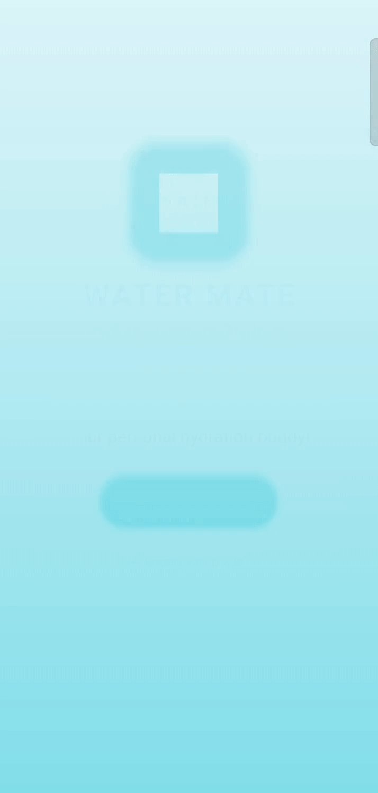

# 💧Water Mate - Your Personal Water Reminder App

WaterMate is a beautifully crafted water reminder app built with **React Native**. It’s not just a hydration tracker — it's your **personal health companion** with a modern, delightful user experience that keeps you motivated to stay hydrated.

## 📹 Demo



## ✨ Features

- 🌊 **Personalized Water Reminders**

  - Get reminders based on your schedule, preferences, and goals.
  - Fully customizable interval and quantity tracking.

- 📱 **Modern UI/UX**

  - Sleek, clean interface with intuitive user interactions.
  - Minimalist yet premium design.

- 🧠 **Onboarding Flow**

  - Smooth, user-friendly onboarding with contextual hints.

- 🎯 **Engaging Notifications**
  - Built using [Notifee](https://notifee.app/) for engaging, local push notifications.
  - Includes **action buttons**, sounds, and deep links.
- 🌗 **Dark Mode Support**

  - Automatically adapts to system theme or toggle manually.

- 📊 **Hydration Stats**

  - Visual charts to track your weekly/monthly intake.
  - Goal progress and motivational insights.

- 👤 **Custom Avatars & Profiles**

  - Add a touch of fun and personalization with user avatars.

- 💥 **Smooth Animations**

  - Micro-interactions and transitions using by React Native Reanimated and React Native SVG and Lottie.

- 📂 **Platform Setup**
  - Currently only supports android.
  - Switched between **Expo** and **Bare Workflow** multiple times to get things just right — and it paid off.

---

## 🛠 Built With

- [React Native](https://reactnative.dev/)
- [Notifee](https://notifee.app/) (for advanced notifications)
- [React Navigation](https://reactnavigation.org/)
- [React Native Reanimated](https://docs.swmansion.com/react-native-reanimated/)
- [Lottie React Native](https://github.com/lottie-react-native/lottie-react-native)
- [Async Storage](https://react-native-async-storage.github.io/async-storage/) (for local state persistence)

---

## 🚧 Development Journey

> This app was built with a mix of curiosity, stubbornness, and a whole lot of late-night caffeine-fueled problem solving.  
> Even though React Native was new to me, I pushed through multiple iterations — switching workflows, debugging weird issues, and learning tools like Notifee just to get **that one feature** working.  
> It’s not perfect, but it’s something that enabled me to push more.

---

## 🔥 Future Plans

- 🧪 Better hydration goal logic based on BMI, activity, and weather
- 🧘 Wellness integrations (like reminders for stretching/breathing)
- ☁️ Cloud sync & user login
- 🗣️ Voice-assisted reminders
- 🎯 Gamification (levels, streaks, rewards!)
- 📂 iOS support

---

## 📥 Installation

```bash
git clone https://github.com/vaibhavxtripathi/Water-Mate.git
cd Water-Mate
npm install
npx react-native run-android

```
